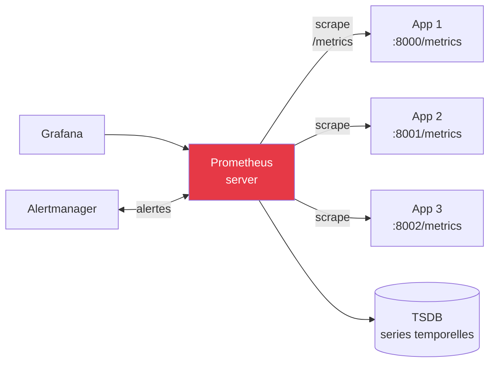

## Module 3
## Métriques & Prometheus

<div class="text-sm opacity-60 mt-4">1h · J2 matin · Counter, Gauge, Histogram, PromQL</div>

---
layout: default
---

### Modèle pull



<div class="text-sm mt-4 opacity-85">

- ✅ Découverte de cible automatique (Kubernetes, file SD, Consul)
- ✅ Santé du scrape elle-même observable (`up{job="api"}`)
- ✅ Pas besoin que l'app sache où envoyer

</div>

---
layout: default
---

### Limites du pull

<div class="text-sm opacity-85 mt-6">

Le pull-based ne convient **pas** :

- 🏃 Pour les **batchs courts** qui meurent avant le scrape suivant
- 🌐 Pour les jobs **derrière NAT/firewall** sans port exposé
- ⚡ Pour les fonctions **serverless** éphémères

</div>

<div class="text-center text-sm mt-8 opacity-70">

→ Solution : <strong>Pushgateway</strong> intermédiaire.<br/>
Ou push direct via <strong>OTLP</strong> (cf. module OpenTelemetry).

</div>

---
layout: default
---

### Définition · métrique

<div class="text-xl opacity-85 mt-6 text-center">

**nom** + **labels** + **valeur numérique** + **timestamp**

</div>

<div class="text-sm mt-8 opacity-85 max-w-3xl mx-auto">

```
http_requests_total{method="POST", status="200", service="api"}  =  4823
└── nom ─────────┘ └────────── labels ──────────────────────┘     └ valeur
```

Chaque **combinaison unique nom + labels** = une **série temporelle** stockée dans le TSDB.

</div>

---
layout: default
---

### 4 types de métriques

<div class="text-sm leading-tight">

| Type | Quand | Exemple |
|------|-------|---------|
| **Counter** | Monotone croissant | `http_requests_total` |
| **Gauge** | Monte et descend | `memory_usage_bytes`, `queue_size` |
| **Histogram** | Distribution (buckets) | `request_duration_seconds` |
| **Summary** | Quantiles côté app | À éviter (pas d'agrégation cross-instances) |

</div>

<div class="text-center text-sm mt-6 opacity-70 text-[#457b9d] font-bold">

Histogram > Summary pour les latences :<br/>
les Histograms s'agrègent, les Summary non.

</div>

---
layout: default
---

### Counter vs Gauge · la confusion classique

<div class="text-sm leading-tight mt-4">

| Métrique | ❌ Type pris | ✅ Bon type | Raison |
|----------|-------------|-------------|--------|
| **Mémoire utilisée** | Counter | **Gauge** | Varie dans les deux sens |
| **Requêtes totales** | Gauge | **Counter** | Croissant monotone |
| **Taille de queue** | Counter | **Gauge** | Monte / descend |
| **Erreurs cumulées** | Gauge | **Counter** | Ne diminue jamais |
| **Connexions DB ouvertes** | Counter | **Gauge** | Pool qui se vide / se remplit |

</div>

<div class="text-center text-sm mt-6 opacity-70 text-[#457b9d] font-bold">

Règle mnémo : <em>peut-il diminuer naturellement ?</em><br/>
→ <strong class="text-[#10b981]">oui = Gauge</strong> · <strong class="text-[#e63946]">non = Counter</strong>

</div>

<!--
- Source : tutorial officiel Prometheus
- "Un Counter enregistre l'accumulation ; une Gauge photographie l'instant"
- L'erreur n°2 des débutants (après "lire un counter brut")
- En cas de doute : si l'app peut redémarrer et la valeur "remonter de zéro", c'est un Counter (les ré-init sont gérées par rate())
-->

---
layout: statement
---

### « Ne jamais lire un<br/><span class="text-[#457b9d]">counter brut</span>.<br/>Utiliser <code class="text-[#10b981]">rate()</code>. »

<div class="text-sm opacity-50 mt-8">— Règle fondamentale Prometheus</div>

<!--
- Un counter peut redémarrer à 0 (restart d'instance) → la valeur brute n'a aucun sens
- rate(metric[5m]) calcule la dérivée et gère les resets automatiquement
- C'est l'erreur n°1 des débutants
-->

---
layout: two-cols-header
---

### `rate()` vs `increase()` — lequel choisir ?

::left::

<div class="text-xs uppercase tracking-widest opacity-60 mb-2 text-[#457b9d]">rate()</div>

```
rate(http_requests_total[5m])
```

<div class="text-sm opacity-85 mt-2">

- Taux **par seconde** sur la fenêtre
- 100 req en 5 min → **~0,33 req/s**
- 📈 Graphes temps réel
- 🚨 Alertes (taux d'erreur, RPS)

</div>

::right::

<div class="text-xs uppercase tracking-widest opacity-60 mb-2 text-[#10b981]">increase()</div>

```
increase(http_requests_total[5m])
```

<div class="text-sm opacity-85 mt-2">

- **Croissance totale** sur la fenêtre
- 100 req en 5 min → **~100**
- 📊 Reporting (volumes/h, /jour)
- 📦 SLO « N événements en X temps »

</div>

<div class="text-center text-sm mt-4 opacity-70 text-[#457b9d] font-bold col-span-2">

`increase(m[w]) ≈ rate(m[w]) × w_secondes` — même info, unité différente.

</div>

<!--
- Source : tutorial officiel Prometheus
- rate() est interpolé : sur une fenêtre courte avec peu de points, il extrapole — préférer une fenêtre ≥ 4 × scrape_interval
- increase() est juste rate() × secondes — utile pour "N erreurs sur la dernière heure"
- ⛔ N'appliquer NI rate() NI increase() sur une Gauge — préférer max_over_time / avg_over_time
-->

---
layout: default
---

### Cardinalité — le piège mortel

<div class="text-sm opacity-85 mt-4">

Formule : `cardinalité = valeurs_label_1 × valeurs_label_2 × …`

</div>

<div class="grid grid-cols-2 gap-6 mt-6 text-sm">

<div class="border-l-4 border-[#10b981] pl-4">
<div class="font-bold mb-2 text-[#10b981]">✅ Bonne cardinalité</div>
<div class="text-xs mt-2">
<code>{method, status, service, region}</code>
</div>
<div class="opacity-85 mt-3">

- 5 méthodes × 10 status × 50 services × 10 régions
- = **25 000 séries**
- Linéaire dans la RAM

</div>
</div>

<div class="border-l-4 border-[#e63946] pl-4">
<div class="font-bold mb-2 text-[#e63946]">⛔ Cardinalité explosive</div>
<div class="text-xs mt-2">
<code>{method, status, service, user_id}</code>
</div>
<div class="opacity-85 mt-3">

- 5 × 10 × 50 × **1 000 000 users**
- = **2,5 milliards de séries**
- OOM brutal du TSDB

</div>
</div>

</div>

---
layout: default
---

### Labels interdits vs autorisés

<div class="grid grid-cols-2 gap-6 mt-4 text-sm">

<div class="border-l-4 border-[#e63946] pl-4">
<div class="font-bold mb-2 text-[#e63946]">⛔ Interdits</div>
<ul class="list-none p-0 space-y-1 opacity-85">
<li>`user_id`, `request_id`, `trace_id`</li>
<li>`email`, `ip_address`</li>
<li>URL complète avec query string</li>
<li>`timestamp`</li>
<li>Message d'erreur brut, stacktrace</li>
</ul>
</div>

<div class="border-l-4 border-[#10b981] pl-4">
<div class="font-bold mb-2 text-[#10b981]">✅ Autorisés</div>
<ul class="list-none p-0 space-y-1 opacity-85">
<li>`method` (5 valeurs)</li>
<li>`status` (~10 valeurs)</li>
<li>`service`, `route` (template)</li>
<li>`environment`, `region`</li>
<li>`model_version` (pour ML)</li>
</ul>
</div>

</div>

---
layout: default
---

### Conventions de nommage

<div class="text-sm opacity-85 mt-4">

Format : `<namespace>_<nom>_<unité>_<suffixe>`

</div>

<div class="text-sm leading-tight mt-4">

| Règle | Bon | Mauvais |
|-------|-----|---------|
| snake_case | `http_requests_total` | `httpRequests` |
| Unités de base | `request_duration_seconds` | `request_duration_ms` |
| Counter suffixé `_total` | `http_requests_total` | `http_requests` |
| Histogram avec `_bucket`, `_sum`, `_count` | (auto par client) | — |

</div>

<div class="text-xs opacity-60 mt-4">Les conventions OTel Semantic Conventions sont compatibles : <code>service.name</code> → label <code>service</code>.</div>

---
layout: default
---

### PromQL essentiel

<div class="text-sm leading-tight">

| Besoin | Requête |
|--------|---------|
| Débit (req/s) | `rate(http_requests_total[5m])` |
| Taux d'erreur 5xx | `sum(rate(http_requests_total{status=~"5.."}[5m])) / sum(rate(http_requests_total[5m]))` |
| Latence p95 | `histogram_quantile(0.95, sum by(le)(rate(request_duration_seconds_bucket[5m])))` |
| Cible UP/DOWN | `up{job="api"}` |
| Incrément sur 1h | `increase(http_requests_total[1h])` |

</div>

<div class="text-center text-xs opacity-60 mt-4">Toujours <code>rate()</code> ou <code>increase()</code> sur un counter — jamais la valeur brute.</div>

---
layout: default
---

### Démo · prometheus_client (1/3)

```python {all|1|3-7|all}
from prometheus_client import Counter, Histogram, Gauge

predictions_total = Counter(
    "ml_predictions_total",
    "Total predictions served",
    ["model_version", "outcome"],
)
```

<div class="text-xs opacity-60 mt-4">

- `Counter` : compteur monotone
- Labels `model_version` + `outcome` (spam/ham) — basses cardinalités
- **Pas** de `user_id` en label !

</div>

---
layout: default
---

### Histogram · comment ça marche

<div class="text-sm opacity-85 mt-2">

Une requête à **0,4 s** avec buckets `[0.3, 0.5, 0.7, 1, +∞]` incrémente **tous** les buckets ≥ 0,4 :

</div>

<div class="text-sm leading-tight mt-2">

| `le=` | après 0.25s | après 0.4s | après 1.1s |
|-------|------------|-----------|------------|
| `0.3` | 1 | 1 | 1 |
| `0.5` | 1 | **2** | 2 |
| `0.7` | 1 | 2 | 2 |
| `1`   | 1 | 2 | 2 |
| `+Inf` | 1 | 2 | **3** |

</div>

<div class="text-sm mt-2 opacity-85">

→ 3 séries exposées par observation : `_bucket{le="…"}`, `_sum`, `_count`<br/>
→ Calcul du p95 côté Prometheus :

</div>

```
histogram_quantile(0.95, sum by(le) (rate(http_duration_seconds_bucket[5m])))
```

<!--
- Source : tutorial officiel Prometheus — table verbatim
- "Cumul croissant" : tous les buckets ≥ la valeur observée incrémentent
- Le bucket +Inf est implicite — c'est aussi _count
- Bonne pratique : toujours `sum by(le) (rate(...[5m]))` AVANT histogram_quantile() pour agréger cross-instances
- Erreur n°3 des débutants : oublier le `rate()` à l'intérieur → quantile sur valeur cumulée = nonsense
-->

---
layout: default
---

### Démo · histogram + gauge (2/3)

```python {all|1-6|8-13|all}
prediction_duration = Histogram(
    "ml_prediction_duration_seconds",
    "Prediction latency",
    ["model_version"],
    buckets=[0.01, 0.05, 0.1, 0.25, 0.5, 1, 2, 5],
)

confidence_score = Histogram(
    "ml_prediction_confidence",
    "Distribution of model confidence",
    ["model_version"],
    buckets=[0.1, 0.3, 0.5, 0.7, 0.9, 1.0],
)
```

<div class="text-xs opacity-60 mt-4">Buckets <strong>choisis à l'avance</strong> selon les SLO (latence cible) ou les seuils métier (confidence).</div>

---
layout: default
---

### Démo · utiliser dans l'endpoint (3/3)

```python {all|2-3|5-9|all}
@app.post("/predict")
def predict(req: PredictRequest):
    with prediction_duration.labels(MODEL_VERSION).time():
        result = model.predict(req.text)

    predictions_total.labels(MODEL_VERSION, result.outcome).inc()
    confidence_score.labels(MODEL_VERSION).observe(result.confidence)
    return result

# Exposer /metrics
from prometheus_client import make_asgi_app
app.mount("/metrics", make_asgi_app())
```

---
layout: default
---

### Démo · prometheus.yml

```yaml {all|1-3|5-13|all}
global:
  scrape_interval: 15s
  evaluation_interval: 15s

scrape_configs:
  - job_name: 'api'
    static_configs:
      - targets: ['api:8000']

  - job_name: 'prometheus-itself'
    static_configs:
      - targets: ['localhost:9090']

rule_files:
  - "rules.yml"

alerting:
  alertmanagers:
    - static_configs:
        - targets: ['alertmanager:9093']
```

---
layout: statement
---

### « Les métriques vous <span class="text-[#e63946]">alertent</span><br/>qu'il y a un problème.<br/>Les logs vous <span class="text-[#10b981]">expliquent</span> lequel. »

<div class="text-sm opacity-50 mt-8">— </div>

---
layout: center
---

### 🛠️ Exercice · 20 min

<div class="text-xl mt-6 max-w-3xl mx-auto">
Sur votre projet brief :
</div>

<div class="text-sm mt-6 space-y-2 opacity-85 max-w-2xl mx-auto text-left">

1. Ajouter `prometheus_client` à `requirements.txt`
2. Exposer **3 métriques** : 1 Counter (predictions), 1 Histogram (latence), 1 Gauge (model version)
3. Monter `/metrics` sur l'API
4. Ajouter Prometheus au `docker-compose.yml` avec scrape de l'API toutes les 15 s
5. Vérifier dans l'UI Prometheus (`localhost:9090`) que la cible est UP

</div>
