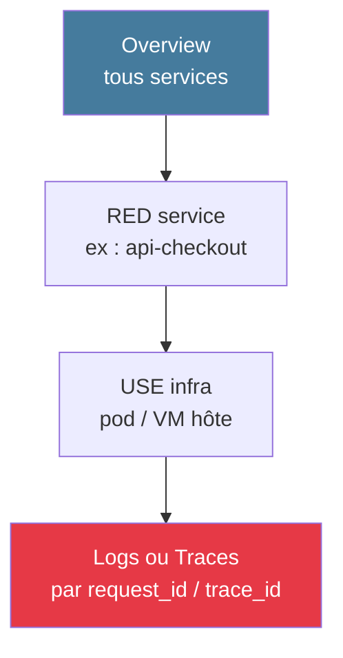

# Module 4
## Grafana & dashboards

<div class="text-sm opacity-60 mt-4">45 min · J2 matin · RED / USE / drill-down</div>

---
layout: default
---

## Concepts Grafana

<div class="text-sm leading-tight">

| Concept | Définition |
|---------|------------|
| **Datasource** | Où les données sont stockées (Prometheus, Loki, Tempo, MySQL...) |
| **Panel** | Une visualisation : time series, stat, gauge, table, heatmap, logs |
| **Dashboard** | Ensemble de panels |
| **Variables** | Sélecteurs dynamiques (`$service`, `$model_version`) |
| **Annotations** | Marqueurs temporels (déploiements, incidents) |

</div>

---
layout: statement
---

## « Un dashboard utile<br/>répond à une question<br/>en moins de <span class="text-[#10b981]">5 secondes</span>. »

<div class="text-sm opacity-50 mt-8">— </div>

---
layout: default
---

## La règle des 3 questions

<div class="grid grid-cols-3 gap-4 mt-6 text-sm">

<div class="border-l-4 border-[#457b9d] pl-4">
<div class="text-3xl font-black mb-2 text-[#457b9d]">1</div>
<div class="font-bold mb-2">Qui consulte ?</div>
<p class="opacity-85">On-call · dev · PO · CTO ?<br/>Pas le même niveau d'abstraction.</p>
</div>

<div class="border-l-4 border-[#10b981] pl-4">
<div class="text-3xl font-black mb-2 text-[#10b981]">2</div>
<div class="font-bold mb-2">Quelle question ?</div>
<p class="opacity-85">« Mon API va-t-elle bien ? » = une question.<br/>« Tout l'écosystème » n'en est pas une.</p>
</div>

<div class="border-l-4 border-[#e63946] pl-4">
<div class="text-3xl font-black mb-2 text-[#e63946]">3</div>
<div class="font-bold mb-2">Quelle action ?</div>
<p class="opacity-85">Si on ne sait pas ce qu'on fait après avoir vu le dashboard, c'est qu'il manque quelque chose.</p>
</div>

</div>

---
layout: default
---

## RED pour services · USE pour infra

<div class="grid grid-cols-2 gap-6 mt-6 text-sm">

<div class="border-l-4 border-[#457b9d] pl-4">
<div class="font-bold mb-2 text-[#457b9d]">RED · services</div>
<ul class="list-none p-0 space-y-1 opacity-85">
<li>**R**ate · requêtes/s</li>
<li>**E**rrors · taux d'erreur</li>
<li>**D**uration · p50, p95, p99</li>
</ul>
<div class="text-xs opacity-60 mt-3">API, microservices, endpoints</div>
</div>

<div class="border-l-4 border-[#10b981] pl-4">
<div class="font-bold mb-2 text-[#10b981]">USE · ressources</div>
<ul class="list-none p-0 space-y-1 opacity-85">
<li>**U**tilization · % occupé</li>
<li>**S**aturation · file d'attente</li>
<li>**E**rrors · erreurs ressources</li>
</ul>
<div class="text-xs opacity-60 mt-3">CPU, RAM, disque, réseau</div>
</div>

</div>

<div class="text-center text-sm mt-6 opacity-70 text-[#457b9d] font-bold">Un dashboard RED + un dashboard USE = couverture complète.</div>

---
layout: default
---

## Hiérarchie drill-down



<div class="text-center text-sm mt-6 opacity-85">

De **« quel service ? »** à **« quelle requête précise ? »**<br/>
en passant par **« quel symptôme ? »** et **« quelle ressource ? »**.

</div>

---
layout: statement
---

## « La moyenne <span class="text-[#e63946]">masque</span> les problèmes.<br/>Affichez toujours <span class="text-[#10b981]">p50 et p99</span>. »

<div class="text-sm opacity-50 mt-8">— </div>

<!--
- Si 99 requêtes prennent 10 ms et 1 prend 10 s → moyenne = 109 ms
- Personne n'a vécu 109 ms — ni l'utilisateur lent, ni les 99 rapides
- p50 = expérience médiane, p99 = expérience du pire 1 %
-->

---
layout: default
---

## Recording rules — pré-calcul

```yaml {all|1-3|4-9|all}
groups:
  - name: red_dashboard_rules
    interval: 30s
    rules:
      - record: service:http_errors:ratio_rate5m
        expr: |
          sum by (service) (rate(http_requests_total{status=~"5.."}[5m]))
          /
          sum by (service) (rate(http_requests_total[5m]))
```

<div class="text-xs opacity-60 mt-4">

Pré-calculer une fois côté Prometheus, lire X fois côté Grafana.<br/>
**Gain** : dashboards 10× plus rapides, datasource déchargée.

</div>

---
layout: default
---

## Annotations de déploiement

```bash {all|1-3|5-8|all}
# Depuis votre CI/CD, après chaque release :
TOKEN=$GRAFANA_TOKEN
URL=https://grafana.example.com/api/annotations

curl -X POST $URL \
  -H "Authorization: Bearer $TOKEN" \
  -H "Content-Type: application/json" \
  -d "{\"text\":\"Deploy api v$VERSION\",\"tags\":[\"deploy\",\"api\"],\"time\":$(date +%s%3N)}"
```

<div class="text-xs opacity-60 mt-4">Une ligne verticale sur tous les graphs → corrélation visuelle déploiement ↔ régression.</div>

---
layout: default
---

## Anti-patterns à éviter

<div class="text-sm opacity-85 mt-4 space-y-2">

- ⛔ Dashboard 40+ panels « au cas où » — personne ne le lit
- ⛔ Refresh à 5 s sur 12 panels = DDoS de la datasource
- ⛔ Couleurs arbitraires (vert = vraiment bon, rouge = vraiment mauvais)
- ⛔ Moyennes seules, sans percentiles
- ⛔ Graphes sans titre explicite
- ⛔ Alerter **depuis** le dashboard (Grafana alerting sans review)
- 👻 **Dashboard fantôme** : pas ouvert depuis 90 jours → **archiver / supprimer**

</div>

---
layout: statement
---

## Dashboards = <span class="text-[#10b981]">lecture</span>.<br/>Alerting = <span class="text-[#e63946]">règles</span>.

<div class="text-xl opacity-85 mt-6">Ne jamais alerter <strong>depuis</strong> un dashboard.</div>

<div class="text-sm opacity-50 mt-8">— </div>

---
layout: default
---

## Pattern · dashboard API ML

<div class="text-sm opacity-85 mt-4">

6 panels minimum pour notre API spam :

</div>

<div class="grid grid-cols-2 gap-4 mt-4 text-sm">

<div class="border-l-4 border-[#457b9d] pl-4 opacity-85">
<ul class="list-none p-0 space-y-1">
<li>📊 **Stat** · RPS courant</li>
<li>🚨 **Stat** · taux d'erreur 5xx</li>
<li>📈 **Time series** · latence p50 / p95 / p99</li>
</ul>
</div>

<div class="border-l-4 border-[#10b981] pl-4 opacity-85">
<ul class="list-none p-0 space-y-1">
<li>📈 **Time series** · RPS par route</li>
<li>🥧 **Time series** · distribution prédictions (classe)</li>
<li>🔢 **Stat** · prédictions par model_version (24h)</li>
</ul>
</div>

</div>

<div class="text-center text-xs opacity-60 mt-4">Max 12 panels par dashboard. 6 = idéal.</div>

---
layout: default
---

## Provisioning · versionner les dashboards

```text
grafana/
├── provisioning/
│   ├── datasources/prometheus.yml
│   └── dashboards/dashboards.yml
└── dashboards/
    ├── api-overview.json
    ├── infra-use.json
    └── ml-monitoring.json
```

<div class="text-sm opacity-85 mt-4 space-y-1">

- Dashboards **dans Git** = revue de code
- Pas de modification manuelle en prod (sauf exploration)
- Restauration automatique en cas de corruption
- **Cohérence** entre environnements

</div>
