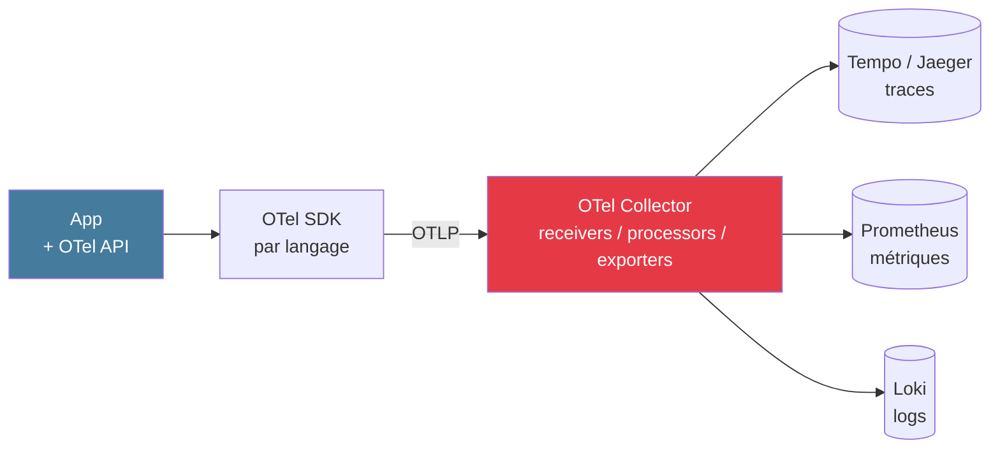
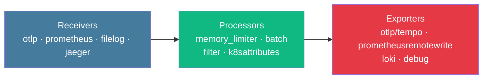

# Module bonus
## OpenTelemetry & Collector

<div class="text-sm opacity-60 mt-4">1h · J2 après-midi · Standard ouvert de l'instrumentation</div>

---
layout: statement
---

## « OpenTelemetry sépare l'<span class="text-[#457b9d]">instrumentation</span><br/>du <span class="text-[#10b981]">stockage</span>. »

<div class="text-xl opacity-85 mt-6">Et c'est cette séparation qui élimine le <strong>vendor lock-in</strong>.</div>

<div class="text-sm opacity-50 mt-8">— </div>

---
layout: default
---

## Origine

<div class="text-sm opacity-85 mt-6 space-y-2">

- **2019, mai** — fusion **OpenTracing** + **OpenCensus** → OpenTelemetry (CNCF)
- Objectif : un **seul SDK** par langage, exportable vers tout backend
- Aujourd'hui : standard de fait de l'instrumentation
- Avant OTel : un SDK par plateforme, agents multiples, formats incompatibles (B3, Jaeger natif, StatsD…)

</div>

<div class="text-center text-sm mt-6 opacity-70">Si vous démarrez une instrumentation aujourd'hui : <strong>OTel</strong>.</div>

---
layout: default
---

## 4 composants



<div class="text-sm mt-4 opacity-85">

- **API** : interfaces stables (no-op sans SDK)
- **SDK** : implémentation par langage
- **OTLP** : protocole unifié — gRPC port **4317**, HTTP port **4318**
- **Collector** : routeur receivers → processors → exporters

</div>

---
layout: default
---

## Maturité des signaux

<div class="text-sm leading-tight">

| Signal | Statut |
|--------|--------|
| **Traces** | GA · 2021 |
| **Métriques** | GA · 2023 |
| **Logs** | GA · 2023 |
| **Profiles** | En développement (4ᵉ signal) |
| **Baggage** | 5ᵉ signal (contexte applicatif) |

</div>

<div class="text-center text-sm mt-6 opacity-70">

Aujourd'hui : <strong>traces, métriques, logs</strong> tous production-ready avec OTel.

</div>

---
layout: default
---

## Auto-instrumentation par langage

<div class="text-sm leading-tight">

| Langage | Comment |
|---------|---------|
| **Java** | `-javaagent:opentelemetry-javaagent.jar` |
| **Python** | `opentelemetry-instrument python app.py` |
| **Node.js** | `--require @opentelemetry/auto-instrumentations-node/register` |
| **.NET** | Env vars `OTEL_DOTNET_AUTO_*` |
| **Go** | Wrapping manuel (eBPF/OBI émergent) |
| **PHP** | Extension PECL |

</div>

<div class="text-xs opacity-60 mt-4">Auto = traces HTTP/DB/queue automatiques sans toucher au code applicatif.</div>

---
layout: statement
---

## Auto = <span class="text-[#457b9d]">plomberie</span>.<br/>Manuel = <span class="text-[#10b981]">métier</span>.

<div class="text-xl opacity-85 mt-6">L'auto-instrumentation trace les tuyaux,<br/>pas la <strong>valeur métier</strong>.</div>

<!--
- Auto = HTTP server, HTTP client, DB, queue, framework
- Manuel = "retrieval_step", "explain_email", "model_inference"
- Les 2 sont complémentaires : auto pour la couverture, manuel pour le sens
-->

---
layout: default
---

## Semantic Conventions

<div class="text-sm opacity-85 mt-4">

Standardisation des attributs entre toutes les libs OTel :

</div>

<div class="text-sm leading-tight mt-4">

| Attribut | Valeur exemple |
|----------|----------------|
| `service.name` | `mailguard-api` |
| `service.version` | `1.4.2` |
| `deployment.environment.name` | `production` |
| `http.request.method` | `POST` |
| `http.response.status_code` | `200` |
| `db.system` | `postgresql` |
| `db.operation.name` | `SELECT` |

</div>

<div class="text-xs opacity-60 mt-4">→ Dashboards / requêtes / alertes <strong>portables</strong> entre backends.</div>

---
layout: default
---

## OTel Collector — architecture



<div class="text-sm mt-4 opacity-85">

- **Receivers** : ingèrent les données (OTLP, Prom scrape, files de log...)
- **Processors** : filtrent, transforment, enrichissent
- **Exporters** : envoient vers les backends

</div>

---
layout: default
---

## 4 patterns de déploiement

<div class="grid grid-cols-2 gap-4 mt-4 text-sm">

<div class="border-l-4 border-[#457b9d] pl-4 opacity-85">
<div class="font-bold mb-2 text-[#457b9d]">Sans collecteur</div>
<p>≤ 10 services<br/>App → backend direct<br/>Vite ingérable</p>
</div>

<div class="border-l-4 border-[#10b981] pl-4 opacity-85">
<div class="font-bold mb-2 text-[#10b981]">Gateway central</div>
<p>10-100 services<br/>Point unique<br/>SPOF si pas de HA</p>
</div>

<div class="border-l-4 border-[#e63946] pl-4 opacity-85">
<div class="font-bold mb-2 text-[#e63946]">Agent + Gateway</div>
<p>Kubernetes à l'échelle<br/>Collecte locale + routage central<br/>Pattern recommandé</p>
</div>

<div class="border-l-4 border-[#f59e0b] pl-4 opacity-85">
<div class="font-bold mb-2 text-[#f59e0b]">Sidecar</div>
<p>Isolation forte<br/>Overhead par pod<br/>Cas spécifiques</p>
</div>

</div>

---
layout: default
---

## Démo · span manuel Python

```python {all|1-2|4-8|10-13|all}
from opentelemetry import trace
tracer = trace.get_tracer(__name__)

def process_checkout(cart_id: str, user_id_hash: str):
    with tracer.start_as_current_span("checkout.process") as span:
        span.set_attribute("cart.id", cart_id)
        span.set_attribute("user.id_hash", user_id_hash)

        with tracer.start_as_current_span("checkout.validate_payment"):
            validate_payment()
        with tracer.start_as_current_span("checkout.write_db"):
            persist_order()
```

<div class="text-xs opacity-60 mt-2">Span racine + 2 sous-spans = arbre de 3 nœuds visible dans le backend.</div>

---
layout: default
---

## Démo · gestion d'erreur

```python
from opentelemetry.trace import Status, StatusCode

try:
    result = process_payment()
except Exception as e:
    span.set_status(Status(StatusCode.ERROR, str(e)))
    span.record_exception(e)
    raise
```

<div class="text-sm mt-6 opacity-85">

- `set_status(ERROR)` marque le span en rouge dans le backend
- `record_exception(e)` capture stacktrace + message
- `raise` propage normalement → l'erreur est aussi loggée

</div>

---
layout: default
---

## Démo · Collector config 3 signaux

```yaml {all|1-7|8-12|13-17|all}
receivers:
  otlp:
    protocols:
      grpc: {endpoint: "0.0.0.0:4317"}
      http: {endpoint: "0.0.0.0:4318"}

processors:
  memory_limiter: {check_interval: 1s, limit_mib: 2048}
  batch: {send_batch_size: 1024, timeout: 5s}

exporters:
  otlp/tempo: {endpoint: "tempo:4317", tls: {insecure: true}}
  prometheusremotewrite: {endpoint: "http://prometheus:9090/api/v1/write"}
  loki: {endpoint: "http://loki:3100/loki/api/v1/push"}

service:
  pipelines:
    traces:  {receivers: [otlp], processors: [memory_limiter, batch], exporters: [otlp/tempo]}
    metrics: {receivers: [otlp], processors: [memory_limiter, batch], exporters: [prometheusremotewrite]}
    logs:    {receivers: [otlp], processors: [memory_limiter, batch], exporters: [loki]}
```

---
layout: default
---

## Anti-patterns Collector

<div class="text-sm opacity-85 mt-4 space-y-2">

- ⛔ `image: otel/opentelemetry-collector:latest` — pin la version, breaking changes
- ⛔ Pas de `memory_limiter` — OOM sous charge
- ⛔ `verbosity: detailed` sur l'exporter `debug` en prod
- ⛔ Labels Loki trop riches (idéal : ≤ 5 labels, jamais request_id / user_id)
- ⛔ `bind 0.0.0.0` en dev — préférer `127.0.0.1`

</div>

<div class="text-center text-sm mt-6 opacity-70">Le Collector = <strong>le routeur de vos données d'observabilité.</strong></div>

---
layout: center
---

## 🛠️ Exercice · 15 min

<div class="text-xl mt-6 max-w-3xl mx-auto">
Sur votre projet brief :
</div>

<div class="text-sm mt-6 max-w-2xl mx-auto space-y-2 opacity-85 text-left">

1. Ajouter `opentelemetry-distro` + `opentelemetry-exporter-otlp`
2. Lancer l'API avec `opentelemetry-instrument python -m uvicorn app.main:app`
3. Ajouter **1 span manuel** dans `/explain` (`with tracer.start_as_current_span("retrieval"):`)
4. Optionnel : ajouter un service `otel-collector` au `docker-compose.yml`

</div>

<div class="text-xs opacity-60 mt-6">Le brief J3 utilisera ce tracing pour le diagnostic du Game Day.</div>
