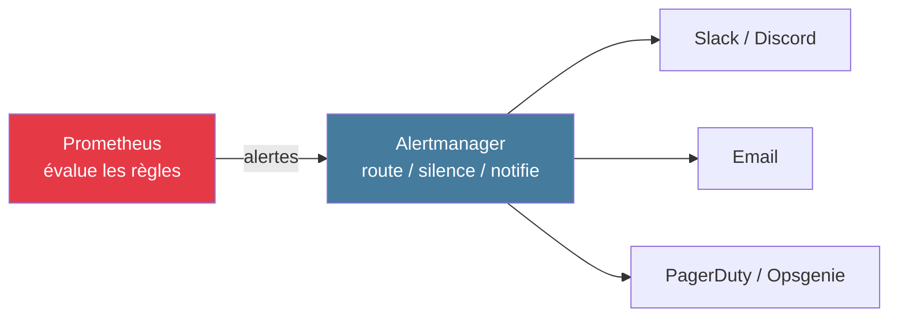
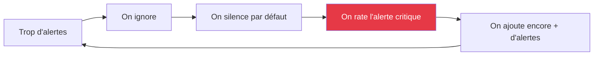

# Module 5
## Alerting

<div class="text-sm opacity-60 mt-4">1h · J3 matin · Alertmanager + SLO + burn rate</div>

---
layout: default
---

## Architecture



<div class="text-sm mt-4 opacity-85">

- **Prometheus** = quand déclencher
- **Alertmanager** = à qui notifier et comment

</div>

---
layout: statement
---

## « Alertez sur les <span class="text-[#10b981]">symptômes</span>,<br/>pas sur les <span class="text-[#e63946]">causes</span>. »

<div class="text-sm opacity-50 mt-8">— </div>

---
layout: default
---

## Symptom-first · exemples

<div class="text-sm leading-tight">

| ⛔ Cause | ✅ Symptôme |
|---------|------------|
| "MySQL down" | "Error rate > 5 % sur service commandes" |
| "CPU > 90 %" | "Latence p99 > 2 s sur API checkout" |
| "Pod CrashLoopBackOff" | "Taux de succès < 99 %" |
| "Disque > 85 %" | "Erreurs d'écriture détectées" |

</div>

<div class="text-center text-sm mt-6 opacity-70 text-[#e63946] font-bold">

Le symptôme est <strong>actionnable par n'importe qui</strong>.<br/>
La cause peut être due à 10 choses différentes.

</div>

---
layout: statement
---

## « Alerter sur <code class="text-[#e63946]">CPU > 90 %</code><br/>est (presque) <span class="text-[#e63946]">toujours inutile</span>. »

<div class="text-xl opacity-85 mt-6">Soit l'app va bien et c'est une bonne utilisation.<br/>Soit elle va mal — et c'est <strong>la latence</strong> qui le dira.</div>

---
layout: default
---

## Engrenage de l'alert fatigue



<div class="text-center text-sm mt-6 opacity-70">

Spirale connue de toutes les équipes d'astreinte mal calibrées.<br/>
La <strong>seule sortie</strong> : sévérité + actionnabilité + runbook.

</div>

---
layout: default
---

## Anatomie d'une règle Prometheus

```yaml {all|2-7|8-13|all}
- alert: PaymentErrorRateHigh
  expr: |
    (sum(rate(http_requests_total{service="payment-api", status=~"5.."}[5m]))
    /
    clamp_min(sum(rate(http_requests_total{service="payment-api"}[5m])), 1)
    ) > 0.01
  for: 5m
  labels:
    severity: critical
    team: payments
  annotations:
    summary: "Taux d'erreur payment-api > 1 %"
    runbook_url: "https://wiki.example.com/runbooks/payment-error-rate"
```

<div class="text-xs opacity-60 mt-2">`clamp_min` évite le NaN si le dénominateur est 0 (pas de trafic).</div>

---
layout: default
---

## Valeurs `for:` par défaut

<div class="text-sm leading-tight mt-6">

| Severity | `for:` | Destination |
|----------|--------|-------------|
| **critical** | 5 min | PagerDuty / page 24/7 |
| **warning** | 15-30 min | Slack heures ouvrées |
| **info** | 1 h+ | Ticket, dashboard |

</div>

<div class="text-center text-sm mt-6 opacity-70 text-[#457b9d] font-bold">

3 niveaux <strong>maximum</strong>. Sinon retour à l'alert fatigue.

</div>

---
layout: default
---

## Alertmanager — 5 mécanismes

<div class="text-sm leading-tight">

| Mécanisme | Rôle |
|-----------|------|
| **Routing** | Diriger vers le bon receiver selon labels |
| **Grouping** | Regrouper les alertes liées (par `alertname`, `service`) |
| **Silencing** | Maintenance planifiée (durée + 30 min, jamais « 24 h au cas où ») |
| **Inhibition** | Une alerte critical supprime une warning du même service |
| **Déduplication** | Évite les doublons cross-cluster |

</div>

---
layout: default
---

## Routing avancé

```yaml {all|1-3|4-10|all}
route:
  receiver: 'default'
  routes:
    - match:
        severity: critical
      receiver: 'pagerduty'
      continue: false
    - match:
        namespace: production
      receiver: 'slack-prod'
    - match_re:
        namespace: dev|staging
      receiver: 'email-dev'
```

<div class="text-xs opacity-60 mt-2">`continue: false` = stop au premier match. `match_re` = expression régulière.</div>

---
layout: default
---

## Inhibition · pas double notification

```yaml
inhibit_rules:
  - source_match:
      alertname: NodeDown
    target_match:
      alertname: PodNotReady
    equal: ['node']
  - source_match:
      severity: critical
    target_match:
      severity: warning
    equal: ['alertname', 'namespace']
```

<div class="text-sm mt-4 opacity-85">

- Si **NodeDown** se déclenche, les **PodNotReady** sur ce node sont supprimées
- Si **critical** se déclenche, la **warning** sur le même service est supprimée

</div>

---
layout: default
---

## SLO & Error Budget

<div class="text-2xl opacity-85 mt-8 text-center">

**Error budget** = <code class="text-[#457b9d]">100 % − SLO</code>

</div>

<div class="text-sm leading-tight mt-6">

| SLO sur 30 jours | Error budget |
|------------------|--------------|
| 99 % | 7 h 12 min |
| **99,5 %** | **3 h 36 min** |
| 99,9 % | 43 min 12 s |
| 99,99 % | 4 min 19 s · presque inatteignable |

</div>

<div class="text-xs opacity-60 mt-4">Passer de 99,9 à 99,99 % coûte souvent 10× plus cher. Chaque 9 = vélocité perdue.</div>

---
layout: default
---

## Burn rate · alerter sur la vitesse

<div class="text-sm opacity-85 mt-4">

`burn_rate = error_rate_actuel / error_rate_acceptable`

Si SLO 99,5 % et erreur actuelle 7 % → burn rate = **14×**.<br/>
À ce rythme, on consomme 100 % du budget mensuel en **~50 heures**.

</div>

<div class="text-sm leading-tight mt-6">

| Alert | Burn rate | Fenêtres | `for:` |
|-------|-----------|----------|--------|
| **Page (critical)** | **14,4×** | 1h + 5min | 2 min |
| **Ticket (warning)** | **6×** | 6h + 30min | 15 min |

</div>

<div class="text-xs opacity-60 mt-4">Méthode <strong>MWMBR</strong> (Multi-Window Multi-Burn-Rate) — Google SRE Workbook ch. 5.</div>

---
layout: default
---

## Watchdog · deadman switch

```yaml
- alert: Watchdog
  expr: vector(1)
  labels:
    severity: info
  annotations:
    summary: "Watchdog — chaîne d'alerting OK"
```

<div class="text-sm mt-6 opacity-85">

- Seule alerte légitime **sans `for:`** — elle se déclenche **toujours**
- Couplée à un **heartbeat** dans l'outil d'astreinte (Dead Man's Snitch, healthchecks.io)
- Si le heartbeat **disparaît** → quelqu'un est notifié
- → Détecte que Prometheus / Alertmanager / webhook est cassé

</div>

---
layout: default
---

## 5 critères production-ready

<div class="grid grid-cols-2 gap-4 mt-4 text-sm">

<div class="border-l-4 border-[#10b981] pl-4 opacity-85">
<div class="font-bold mb-2 text-[#10b981]">✅ Une alerte doit avoir :</div>
<ul class="list-none p-0 space-y-1">
<li>**Owner** clairement identifié</li>
<li>**Runbook** lié (annotation)</li>
<li>**Severity** justifiée</li>
<li>**Actionnable** par celui qui la reçoit</li>
<li>**Testée** avant la mise en critical</li>
</ul>
</div>

<div class="border-l-4 border-[#e63946] pl-4 opacity-85">
<div class="font-bold mb-2 text-[#e63946]">⛔ Sinon :</div>
<ul class="list-none p-0 space-y-1">
<li>Personne ne sait quoi faire</li>
<li>L'astreinte improvise à 3h du matin</li>
<li>Ton/équipe inadéquate notifiée</li>
<li>Faux positifs en cascade</li>
<li>Engagement de l'équipe érodé</li>
</ul>
</div>

</div>

---
layout: statement
---

## Une équipe ne devrait pas recevoir<br/>plus de <span class="text-[#e63946]">2-3 pages critical</span><br/>par semaine.

<div class="text-sm opacity-50 mt-8">— Règle pragmatique/div>

---
layout: default
---

## Métriques d'alerting · à monitorer

<div class="text-sm leading-tight mt-4">

| Métrique | Cible |
|----------|-------|
| **MTTA** · acquittement | < 15 min |
| % alertes **actionnables** | > 80 % |
| Alertes **flappy** | < 5 % |
| Alertes silencées long terme | < 10 % |
| Alertes critical **sans runbook** | **0 %** |

</div>

<div class="text-center text-sm mt-6 opacity-70">

Mesurer son propre alerting = pré-requis pour l'améliorer.

</div>

---
layout: center
---

## 🛠️ Exercice · 20 min

<div class="text-xl mt-6 max-w-3xl mx-auto">
Sur votre projet brief :
</div>

<div class="text-sm mt-6 max-w-2xl mx-auto space-y-2 opacity-85 text-left">

1. Ajouter `alertmanager` au `docker-compose.yml` (port 9093)
2. Créer `rules.yml` avec **2 alertes** :
   - `HighLatencyP95` (p95 > 1 s pendant 5 min, severity: warning)
   - `HighErrorRate` (taux 5xx > 1 % pendant 5 min, severity: critical)
3. Annoter chaque règle avec `runbook_url` (peut pointer vers le futur post-mortem)
4. Configurer un webhook Discord/Slack (lien fourni par formateur)
5. Tester en provoquant une erreur

</div>
