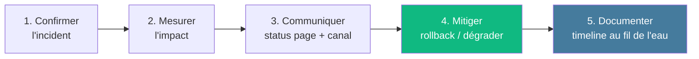

# Module 7
## Incident management & post-mortem

<div class="text-sm opacity-60 mt-4">45 min · J3 après-midi · Runbook, SEV, blameless</div>

---
layout: default
---

## Démarche de diagnostic



<div class="text-center text-sm mt-6 opacity-70 text-[#457b9d] font-bold">

Mitiger <strong>d'abord</strong>. Corriger ensuite.

</div>

---
layout: default
---

## Triage 60 secondes

<div class="grid grid-cols-2 gap-4 mt-4 text-sm">

<div class="border-l-4 border-[#457b9d] pl-4">
<div class="font-bold mb-2 text-[#457b9d]">1 · Confirmer l'impact</div>
<p class="opacity-85">Vrai problème ou faux positif ? Vérifier sur 2 dashboards indépendants.</p>
</div>

<div class="border-l-4 border-[#10b981] pl-4">
<div class="font-bold mb-2 text-[#10b981]">2 · Blast radius</div>
<p class="opacity-85">Combien d'utilisateurs ? Lesquels ? Depuis quand ?</p>
</div>

<div class="border-l-4 border-[#e63946] pl-4">
<div class="font-bold mb-2 text-[#e63946]">3 · Dernier changement</div>
<p class="opacity-85">Quoi a été déployé dans les 30 dernières minutes ? (annotations)</p>
</div>

<div class="border-l-4 border-[#f59e0b] pl-4">
<div class="font-bold mb-2 text-[#f59e0b]">4 · Mitiger 🛑 RCA</div>
<p class="opacity-85">Rollback / kill switch / feature flag <strong>avant</strong> de chercher la cause racine.</p>
</div>

</div>

---
layout: statement
---

## « Ne pas chercher la <span class="text-[#e63946]">cause racine</span><br/>pendant que les <span class="text-[#10b981]">utilisateurs souffrent</span>. »

<div class="text-sm opacity-50 mt-8">— </div>

---
layout: default
---

## Grille de sévérité

<div class="text-sm leading-tight mt-4">

| Severity | Critères | Réponse | Temps de réponse |
|----------|----------|---------|------------------|
| **SEV-1** | > 50 % users · core down · fuite données | IC + équipe complète | < 15 min |
| **SEV-2** | < 50 % users · contournement possible | On-call + lead | < 30 min |
| **SEV-3** | Impact limité · fonctionnalité secondaire | On-call | < 4 h heures ouvrées |

</div>

<div class="text-center text-sm mt-6 opacity-70 text-[#457b9d] font-bold">

C'est l'<strong>impact</strong> qui décide. Pas l'alerte.

</div>

---
layout: default
---

## 4 rôles en SEV-1

<div class="grid grid-cols-2 gap-4 mt-4 text-sm">

<div class="border-l-4 border-[#457b9d] pl-4">
<div class="font-bold mb-2 text-[#457b9d]">🎯 Incident Commander (IC)</div>
<p class="opacity-85">Coordonne, prend les décisions.<br/><strong>Ne tape pas de commandes.</strong></p>
</div>

<div class="border-l-4 border-[#10b981] pl-4">
<div class="font-bold mb-2 text-[#10b981]">⚒️ Ops Lead</div>
<p class="opacity-85">Exécute les actions techniques.<br/>Communique avec l'IC.</p>
</div>

<div class="border-l-4 border-[#e63946] pl-4">
<div class="font-bold mb-2 text-[#e63946]">✍️ Scribe</div>
<p class="opacity-85">Timeline temps réel :<br/>`[HH:MM] action — @qui — résultat`</p>
</div>

<div class="border-l-4 border-[#f59e0b] pl-4">
<div class="font-bold mb-2 text-[#f59e0b]">📢 Communicateur</div>
<p class="opacity-85">Status page + management.<br/>Update toutes les 15-30 min.</p>
</div>

</div>

---
layout: default
---

## Lecture conjointe · logs + métriques + traces

<div class="text-sm opacity-85 mt-6 space-y-2">

1. Voir l'alerte sur Grafana → identifier la **fenêtre temporelle**
2. Filtrer les logs sur la fenêtre, par `level=ERROR`
3. Récupérer un `request_id` ou `trace_id` d'une erreur représentative
4. Tracer son parcours via le backend de traces (Tempo / Jaeger)
5. Repérer le **span lent** ou en erreur (souvent visible immédiatement)
6. Comparer avec dashboard `model_version` / déploiement (annotations CI/CD)

</div>

<div class="text-center text-sm mt-6 opacity-70">

C'est le **diagnostic en T inversé** :<br/>
métriques agrégées (horizontale) → trace précise (verticale).

</div>

---
layout: default
---

## Runbook · 5 sections

<div class="text-sm leading-tight">

| Section | Contenu |
|---------|---------|
| **Prérequis** | Accès, toolbox, conventions |
| **Symptôme** | Ce que l'alerte affiche, ce que l'utilisateur ressent |
| **Diagnostic** | Comment vérifier en 1-2 commandes |
| **Remédiation** | Actions concrètes ordonnées (rollback, scale, restart...) |
| **Escalade** | Qui contacter et quand (>15 min sans diagnostic, >30 min sans mitigation) |

</div>

<div class="text-xs opacity-60 mt-4">

Toolbox utile (K8s) :<br/>
<code>kubectl run -it --rm debug --image=nicolaka/netshoot -- bash</code>

</div>

---
layout: statement
---

## Post-mortem<br/><span class="text-[#10b981]">blameless</span> ≠ sans <span class="text-[#e63946]">responsabilité</span>.

<div class="text-xl opacity-85 mt-6">

Chaque <strong>action item</strong> a un <strong>owner</strong> et une <strong>deadline</strong>.

</div>

<!--
- Google SRE : "un postmortem blameless fait que les ingénieurs se sentent en sécurité pour rapporter les détails"
- Mais : blameless ≠ "personne n'est responsable de rien"
- L'enjeu : extraire les apprentissages systémiques sans punir l'individu
-->

---
layout: default
---

## Template post-mortem

```markdown
# Post-mortem — [Titre de l'incident]
**Date** : YYYY-MM-DD
**Durée** : XXX minutes
**Sévérité** : SEV-1 / SEV-2 / SEV-3
**Impact** : nombre d'utilisateurs, fonctionnalités

## Résumé en 3 lignes
## Timeline (UTC)
## Détection (alerte auto / signalement ?)
## Root cause technique (sans blâmer une personne)
## Ce qui a bien / mal fonctionné
## Actions correctives (owners + dates)
  - [ ] Prévention   — @owner — YYYY-MM-DD
  - [ ] Détection    — @owner — YYYY-MM-DD
  - [ ] Mitigation   — @owner — YYYY-MM-DD
  - [ ] Remédiation  — @owner — YYYY-MM-DD
  - [ ] Résilience   — @owner — YYYY-MM-DD
```

---
layout: default
---

## 4 métriques · MTTD · MTTA · MTTR · MTBF

<div class="text-sm leading-tight mt-4">

| Métrique | Définition | Cible SEV-1 |
|----------|------------|-------------|
| **MTTD** · Mean Time To **Detect** | Délai entre incident et détection | < 5 min |
| **MTTA** · Mean Time To **Acknowledge** | Délai entre alerte et prise en charge | < 15 min |
| **MTTR** · Mean Time To **Recovery** | Délai entre incident et retour à un service acceptable | < 1 h |
| **MTBF** · Mean Time **Between Failures** | Stabilité globale du système | À maximiser |

</div>

<div class="text-center text-sm mt-6 opacity-70 text-[#457b9d] font-bold">

MTTR = retour à une **expérience utilisateur acceptable**.<br/>
Pas « tous les systèmes parfaits ».

</div>
