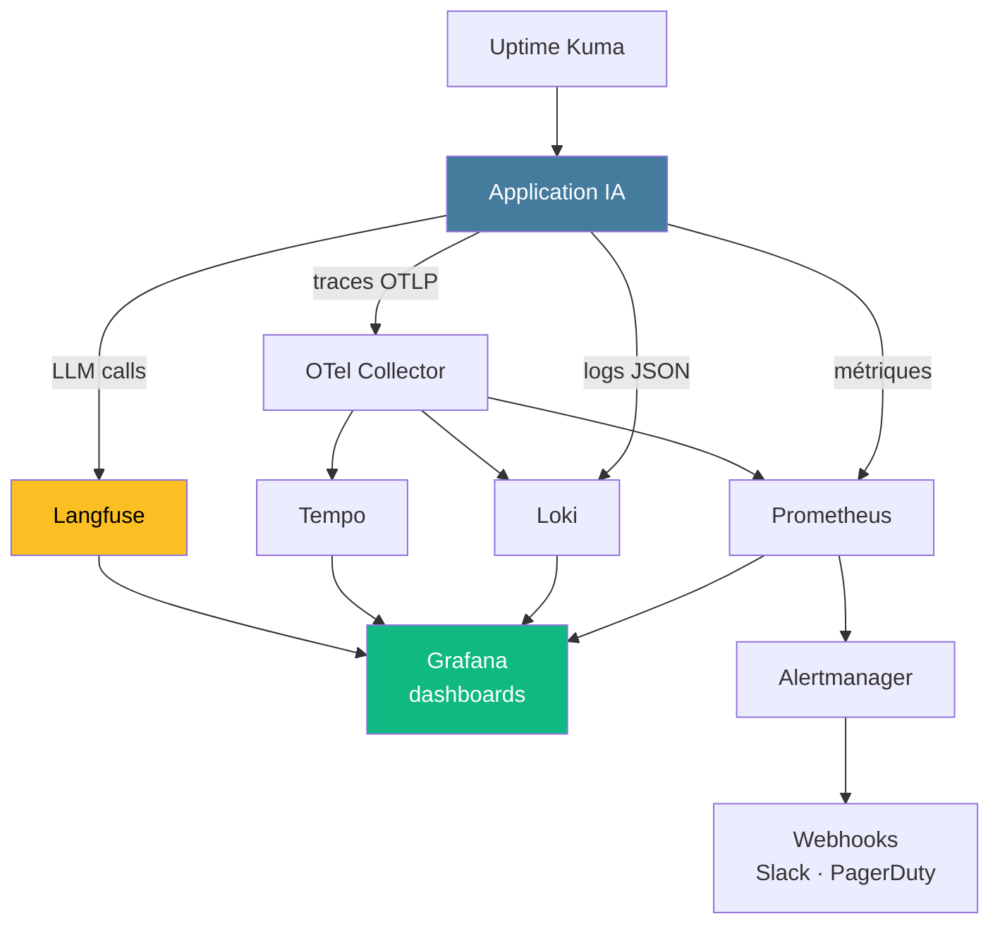

## Wrap-up
## Ce qu'on a vu · ce qui vous attend

30 min · récap · ressources · livrables

---
layout: default
---

<h3 class="text-3xl mb-4">3 choses à retenir</h3>

📊

#### Logs, métriques, traces : 3 rôles complémentaires

Les métriques vous **alertent** qu'il y a un problème, les logs vous **expliquent** lequel, les traces montrent **où** dans la chaîne d'appels.

🚨

#### Alertez sur les symptômes, pas les causes

SLO + error budget + burn rate valent mieux qu'un seuil `CPU > 90 %`. Objectif : pas plus de 2-3 pages critiques par semaine.

🤖

#### L'IA ajoute deux couches d'observability

Drift modèle (souvent silencieux) et tracing LLM (coût, latence, qualité via Langfuse) s'ajoutent à la stack classique.

<!--
- 3 cartes = 3 messages clés à mémoriser
- Si on retient une seule chose : les 3 signaux (logs/métriques/traces) répondent à 3 questions différentes
- Si on retient une seule action : passer les alertes CPU/RAM en alertes symptom-first (SLO)
-->

---
layout: default
---

### Stack observability « idéale »

---
layout: default
---

### Que choisir ? · récap par cas d'usage

| Cas d'usage | Outil recommandé |
|-------------|------------------|
| Métriques d'infra et d'app | **Prometheus + Grafana** |
| Logs centralisés | Loki + Grafana · ELK selon ergonomie |
| Tracing distribué applicatif | **OpenTelemetry + Tempo / Jaeger** |
| Tracking d'expériences ML | **MLflow** ou W&B |
| Détection de drift | **Evidently AI** + export Prometheus |
| Drift embeddings | **Phoenix** |
| Tracing LLM / agents | **Langfuse** (OSS) ou LangSmith (LangChain) |
| Suivi coût tokens | **Langfuse** ou LangSmith |
| Monitoring externe | **Uptime Kuma** |

---
layout: default
---

### Ressources

**App observability**

- Prometheus docs · https://prometheus.io/docs/
- Grafana docs · https://grafana.com/docs/grafana/latest/
- Google SRE Book — Monitoring Distributed Systems

**ML monitoring & drift**

- Evidently AI · https://docs.evidentlyai.com/
- MLflow · https://mlflow.org/docs/latest/tracking.html
- Phoenix · https://docs.arize.com/phoenix

**LLM observability**

- Langfuse · https://langfuse.com/docs
- LangSmith · https://docs.smith.langchain.com/
- OpenAI pricing · https://openai.com/api/pricing/

---
layout: default
---

### Niveaux de maturité · votre prochain palier

| Niveau | Vous y êtes ? | Prochaine étape |
|--------|---------------|------------------|
| **1 · Réactif** | Logs en fichier + métriques infra | → Structurer les logs (M2) |
| **2 · Structuré** | RED/USE + alerting | → Ajouter SLO + tracing (M5, M6, OTel) |
| **3 · Proactif** ⭐ | SLO + traces + corrélation | → Gouvernance, multi-tenant (M-OTel avancé) |
| **4 · Gouverné** | OTel + budgets cardinalité + RACI | → Optimisation continue |

Cible de cette formation : passer du niveau 1-2 au niveau **3**.

---
layout: default
---

### Livrables attendus

| Livrable | Statut |
|----------|--------|
| Projet brief instrumenté (logs + métriques + dashboards + alertes) | À rendre J3 fin |
| Langfuse intégré + 1 score | À rendre J3 fin |
| Post-mortem Game Day (1 incident minimum) | À rendre J3 fin |
| Repo Git public ou interne avec README à jour | À rendre J3+7 |

Critères d'évaluation : voir slide brief J2. 
Retour individuel sur les rendus dans la semaine.

---
layout: cover
background: <https://images.unsplash.com/photo-1579546929518-9e396f3cc809?w=1920>
---

<ThankYou deck-slug="observability" />
