# Wrap-up
## Ce qu'on a vu · ce qui vous attend

30 min · récap · ressources · livrables

---
layout: default
---

## Stack observability « idéale »

```mermaid {scale: 0.85}
graph TB
    A[Application IA] -->|logs JSON| L[Loki]
    A -->|métriques| P[Prometheus]
    A -->|traces OTLP| C[OTel Collector]
    A -->|LLM calls| LF[Langfuse]
    C --> P
    C --> L
    C --> T[Tempo]
    P --> G[Grafana<br/>dashboards]
    L --> G
    T --> G
    LF --> G
    P --> AM[Alertmanager]
    AM --> W[Webhooks<br/>Slack · PagerDuty]
    UK[Uptime Kuma] --> A
    style A fill:#457b9d,color:#fff
    style G fill:#10b981,color:#fff
    style LF fill:#fbbf24,color:#000
```

---
layout: default
---

## Que choisir ? · récap par cas d'usage

| Cas d'usage | Outil recommandé |
|-------------|------------------|
| Métriques d'infra et d'app | **Prometheus + Grafana** |
| Logs centralisés | Loki + Grafana · ELK selon ergonomie |
| Tracing distribué applicatif | **OpenTelemetry + Tempo / Jaeger** |
| Tracking d'expériences ML | **MLflow** ou W&B |
| Détection de drift | **Evidently AI** + export Prometheus |
| Drift embeddings | **Phoenix** |
| Tracing LLM / agents | **Langfuse** (OSS) ou LangSmith (LangChain) |
| Suivi coût tokens | **Langfuse** ou LangSmith |
| Monitoring externe | **Uptime Kuma** |

---
layout: default
---

## Niveaux de maturité · votre prochain palier

| Niveau | Vous y êtes ? | Prochaine étape |
|--------|---------------|------------------|
| **1 · Réactif** | Logs en fichier + métriques infra | → Structurer les logs (M2) |
| **2 · Structuré** | RED/USE + alerting | → Ajouter SLO + tracing (M5, M6, OTel) |
| **3 · Proactif** ⭐ | SLO + traces + corrélation | → Gouvernance, multi-tenant (M-OTel avancé) |
| **4 · Gouverné** | OTel + budgets cardinalité + RACI | → Optimisation continue |

Cible de cette formation : passer du niveau 1-2 au niveau **3**.

---
layout: default
---

## Ressources

**App observability**

- Prometheus docs · https://prometheus.io/docs/
- Grafana docs · https://grafana.com/docs/grafana/latest/
- Google SRE Book — Monitoring Distributed Systems

**ML monitoring & drift**

- Evidently AI · https://docs.evidentlyai.com/
- MLflow · https://mlflow.org/docs/latest/tracking.html
- Phoenix · https://docs.arize.com/phoenix

**LLM observability**

- Langfuse · https://langfuse.com/docs
- LangSmith · https://docs.smith.langchain.com/
- OpenAI pricing · https://openai.com/api/pricing/

---
layout: default
---

## Livrables attendus

| Livrable | Statut |
|----------|--------|
| Projet brief instrumenté (logs + métriques + dashboards + alertes) | À rendre J3 fin |
| Langfuse intégré + 1 score | À rendre J3 fin |
| Post-mortem Game Day (1 incident minimum) | À rendre J3 fin |
| Repo Git public ou interne avec README à jour | À rendre J3+7 |

Critères d'évaluation : voir slide brief J2. 
Retour individuel sur les rendus dans la semaine.

---
layout: end
background: https://images.unsplash.com/photo-1485827404703-89b55fcc595e?w=1920
class: text-left
---

  

    
Merci · Questions ?

    <h1 class="text-6xl font-black leading-tight mb-8">
      Let's  observe together
    </h1>
    

      <a href="mailto:hello@maxime-lenne.fr" class="flex items-center gap-2 no-underline opacity-75 hover:opacity-100">✉️ hello@maxime-lenne.fr</a>
      <a href="https://maxime-lenne.fr" target="_blank" class="flex items-center gap-2 no-underline opacity-80 hover:opacity-100">🌐 maxime-lenne.fr</a>
    

    

      
      
LinkedIn

    

  

Slides built with <a href="https://sli.dev" class="no-underline">sli.dev</a> · Thème maxime-lenne

<!--
- Call to action final — laisser le QR code visible pendant les questions
- Rappeler les livrables et le retour sur les rendus
- Encourager à partager le résultat sur LinkedIn (tag formateur)
-->
