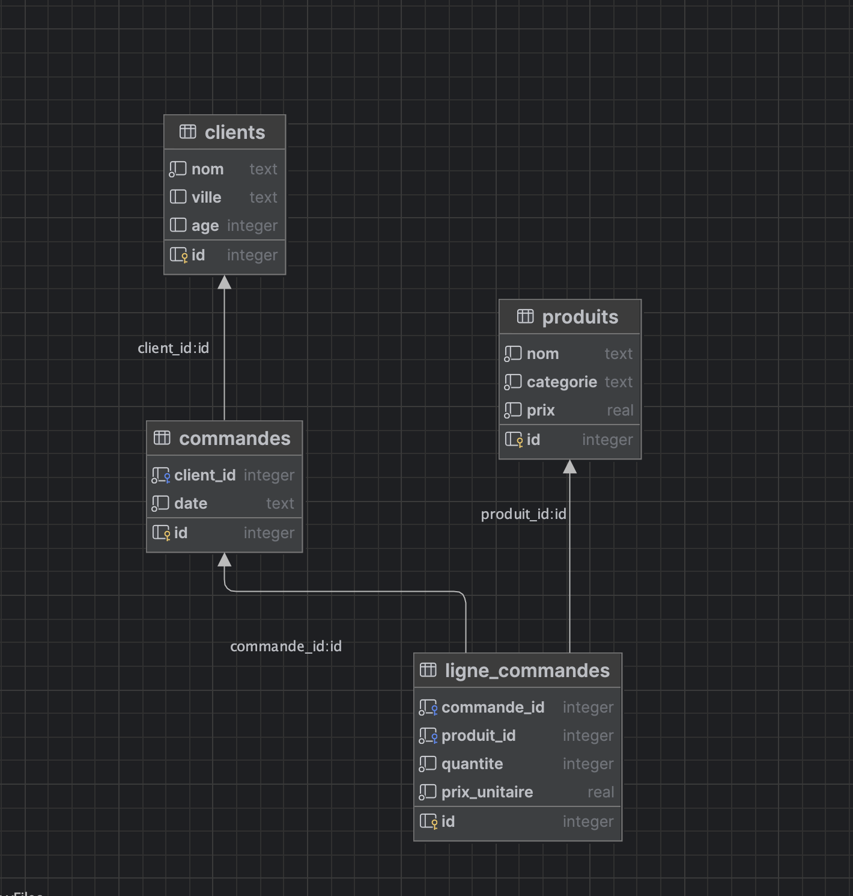

# Mise en pratique n°2  
## Analyse des ventes avec JOINS, GROUP BY & Sous-requêtes

---

# 📥 Télécharger la base d'entraînement

<div class="grid grid-cols-2 gap-8 items-center">
  <div>

Base SQLite pour tous les exercices :
**formation_joins.db**

  </div>
  <div>
    
  </div>
</div>

---

# 📝 Les 10 questions à résoudre

1. Lister toutes les commandes avec le nom du client  
2. Lister toutes les commandes (même sans lignes) avec le nombre de lignes  
3. Afficher les lignes de commande avec nom du produit, quantité et total ligne  
4. Calculer le total de chaque commande et trier par total décroissant  
5. Trouver les clients sans commandes  
6. Trouver les produits jamais vendus  
7. Top 3 des clients par montant dépensé  
8. Ventes par ville  
9. Ventes par catégorie produit  
10. Commandes dont le total est supérieur à la moyenne

---

# Réponse 1 — INNER JOIN clients ↔ commandes

### Requête SQL

```sql
SELECT c.id AS commande_id,
       c.date,
       cl.nom AS client
FROM commandes c
JOIN clients cl ON cl.id = c.client_id
ORDER BY c.date DESC;
```

### Schéma JOIN (A ∩ B)

```text
   [ Clients ] ∩ [ Commandes ]
```

### Exemple de résultat

| commande_id | date       | client        |
|-------------|-----------|----------------|
| 12          | 2025-02-01 | Camille Leroy |
| 10          | 2025-01-15 | Alice Martin  |

---

# Réponse 2 — LEFT JOIN commandes ↔ lignes

### Requête SQL

```sql
SELECT c.id AS commande_id,
       c.date,
       COUNT(lc.id) AS nb_lignes
FROM commandes c
LEFT JOIN ligne_commandes lc ON lc.commande_id = c.id
GROUP BY c.id;
```

### Schéma JOIN

```text
LEFT JOIN = Tout A + Intersection
(A = commandes, B = ligne_commandes)
```

### Exemple résultat

| commande_id | date       | nb_lignes |
|-------------|-----------|-----------|
| 1           | 2025-01-10 | 2         |
| 2           | 2024-12-05 | 1         |

---

# Réponse 3 — Lignes + Produits

### SQL

```sql
SELECT lc.commande_id,
       p.nom AS produit,
       lc.quantite,
       lc.prix_unitaire,
       lc.quantite * lc.prix_unitaire AS total_ligne
FROM ligne_commandes lc
JOIN produits p ON p.id = lc.produit_id;
```

### Schéma JOIN

```text
ligne_commandes ⋂ produits
```

### Exemple résultat

| commande_id | produit         | qte | total_ligne |
|--------------|-----------------|-----|-------------|
| 1            | Souris sans fil | 2   | 69.00       |

---

# Réponse 4 — Total par commande

### SQL

```sql
SELECT c.id,
       cl.nom,
       SUM(lc.quantite * lc.prix_unitaire) AS total_commande
FROM commandes c
JOIN clients cl ON cl.id = c.client_id
LEFT JOIN ligne_commandes lc ON lc.commande_id = c.id
GROUP BY c.id
ORDER BY total_commande DESC;
```

### Schéma

```text
clients ⋂ commandes ⋂ ligne_commandes
```

### Exemple résultat

| commande_id | client       | total |
|-------------|--------------|--------|
| 1           | Alice Martin | 158.90 |

---

# Réponse 5 — Clients sans commandes

### SQL

```sql
SELECT cl.*
FROM clients cl
LEFT JOIN commandes c ON c.client_id = cl.id
WHERE c.id IS NULL;
```

### Schéma

```text
LEFT JOIN (partie A sans B)
```

### Résultat exemple

| id | nom         | ville | age |
|----|-------------|--------|-----|
| 11 | Katia Russo | Nice   | 28  |

---

# Réponse 6 — Produits jamais vendus

### SQL

```sql
SELECT p.*
FROM produits p
LEFT JOIN ligne_commandes lc ON lc.produit_id = p.id
WHERE lc.id IS NULL;
```

### Schéma

```text
Produits LEFT JOIN ligne_commandes (A sans B)
```

---

# Réponse 7 — Top 3 clients dépensiers

### SQL

```sql
SELECT cl.nom,
       SUM(lc.quantite * lc.prix_unitaire) AS total
FROM clients cl
JOIN commandes c ON c.client_id = cl.id
JOIN ligne_commandes lc ON lc.commande_id = c.id
GROUP BY cl.id
ORDER BY total DESC
LIMIT 3;
```

---

# Réponse 8 — Ventes par ville

### SQL

```sql
SELECT cl.ville,
       SUM(lc.quantite * lc.prix_unitaire) AS total
FROM clients cl
JOIN commandes c ON c.client_id = cl.id
JOIN ligne_commandes lc ON lc.commande_id = c.id
GROUP BY cl.ville
ORDER BY total DESC;
```

---

# Réponse 9 — Ventes par catégorie

### SQL

```sql
SELECT p.categorie,
       SUM(lc.quantite * lc.prix_unitaire) AS total
FROM produits p
LEFT JOIN ligne_commandes lc ON lc.produit_id = p.id
GROUP BY categorie;
```

---

# Réponse 10 — Commandes > moyenne

### SQL

```sql
WITH totals AS (
  SELECT c.id AS commande_id,
         SUM(lc.quantite * lc.prix_unitaire) AS total
  FROM commandes c
  LEFT JOIN ligne_commandes lc ON lc.commande_id = c.id
  GROUP BY c.id
)
SELECT *
FROM totals
WHERE total > (SELECT AVG(total) FROM totals);
```

---
layout: center
transition: fade
---

# 🎉 Fin
