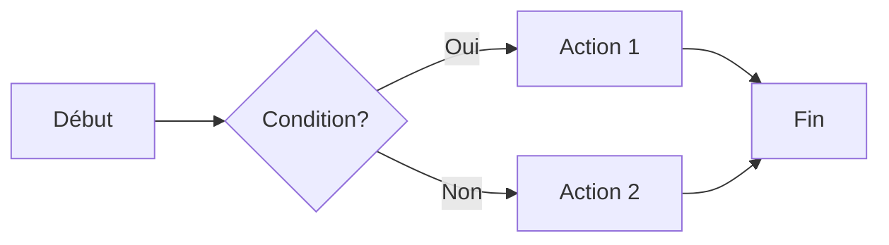
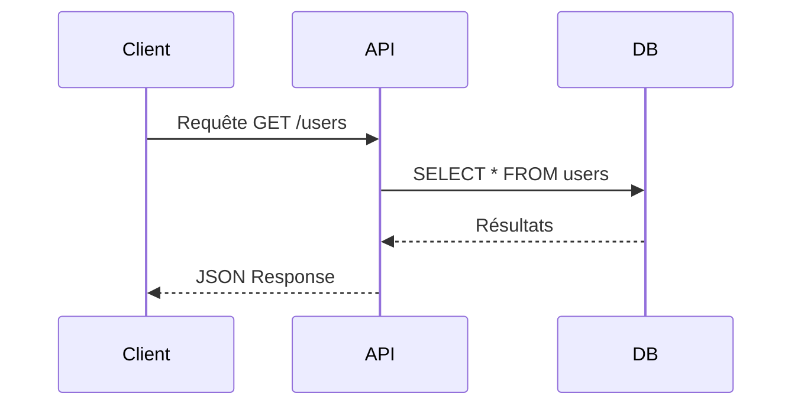
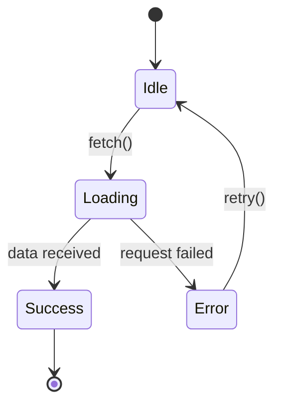
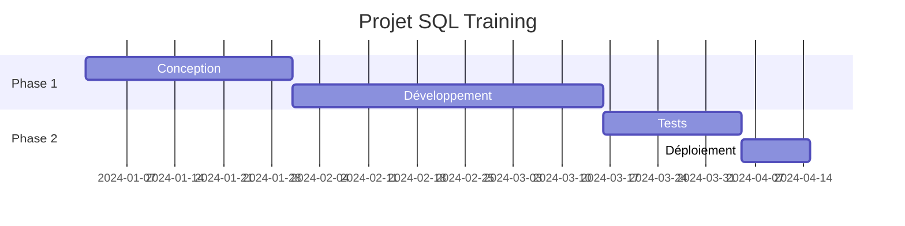
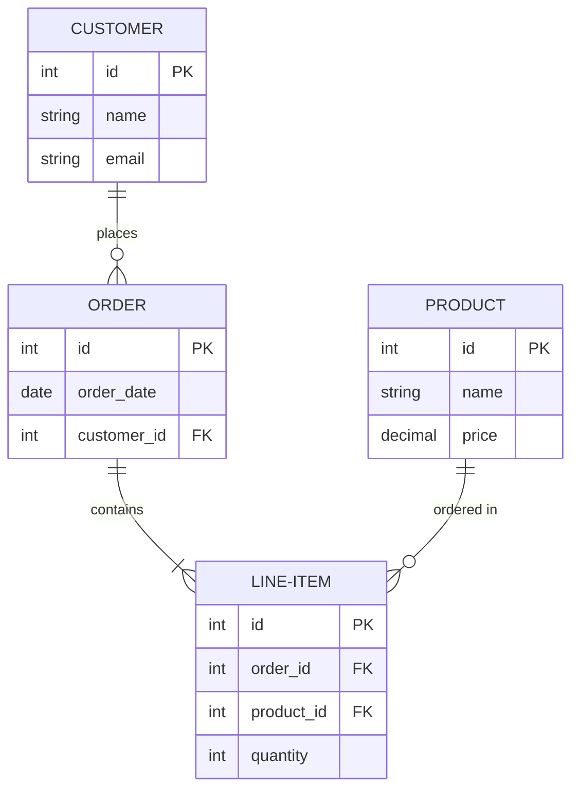

# Section 4 : Diagrammes & Visualisations

Mermaid, PlantUML, etc.

---

# Diagrammes Mermaid

## Flowchart

---

# Mermaid - Sequence Diagram

---

# Mermaid - State Diagram

---

# Mermaid - Gantt

---

# Mermaid - ER Diagram

