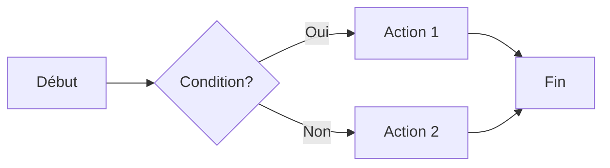
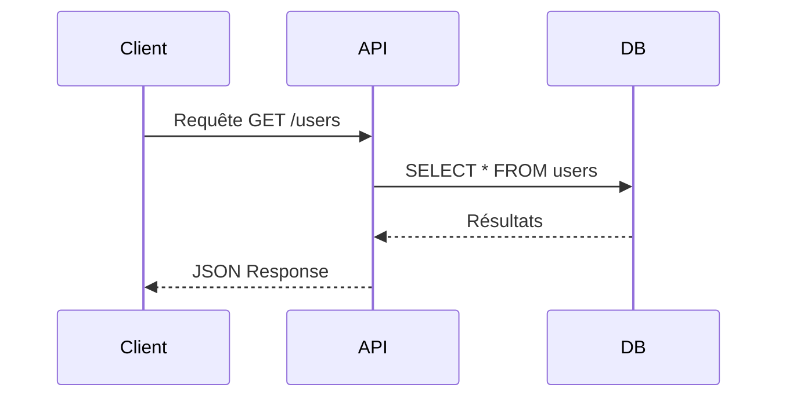
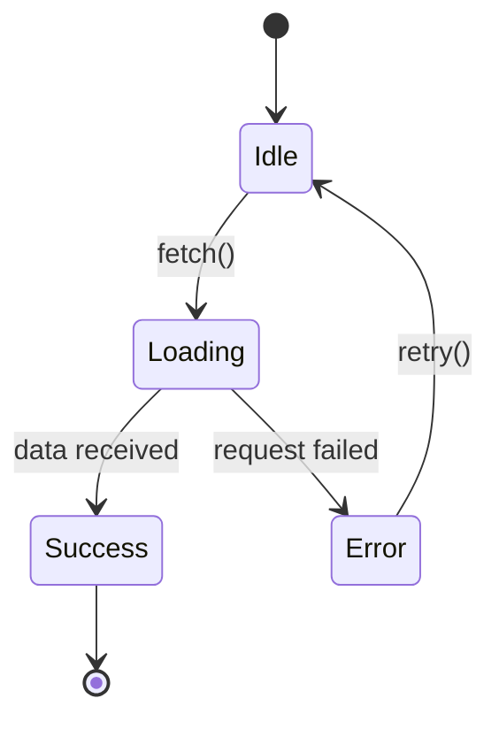
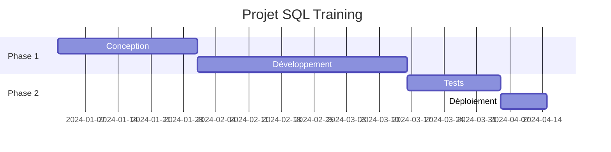
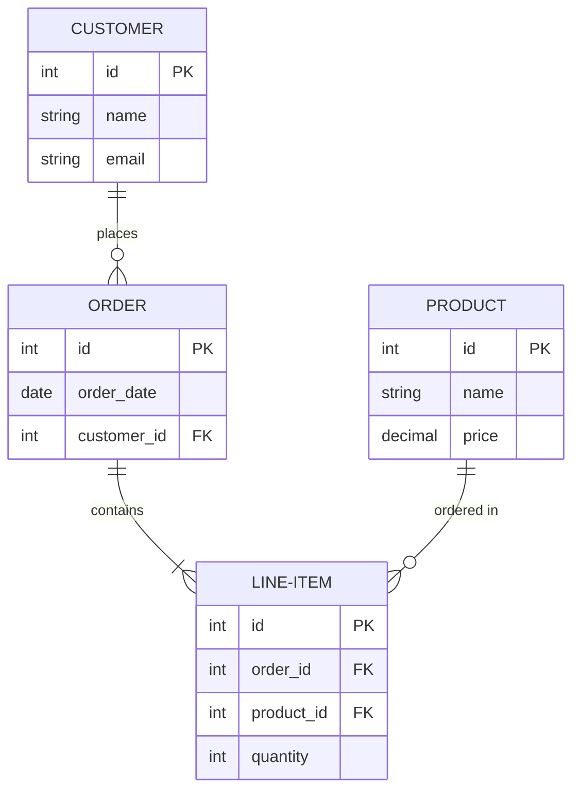

# Thème Maxime Lenne

## Test Exhaustif des Fonctionnalités Slidev

Test de tous les layouts, composants et éléments markdown

<div class="pt-12">
  <span @click="$slidev.nav.next" class="px-2 py-1 rounded cursor-pointer" hover="bg-white bg-opacity-10">
    Commencer le test <carbon:arrow-right class="inline"/>
  </span>
</div>

<div class="abs-br m-6 flex gap-2">
  <button @click="$slidev.nav.openInEditor()" title="Open in Editor" class="text-xl slidev-icon-btn opacity-50 !border-none !hover:text-white">
    <carbon:edit />
  </button>
  <a href="https://github.com/slidevjs/slidev" target="_blank" alt="GitHub" title="Open in GitHub"
    class="text-xl slidev-icon-btn opacity-50 !border-none !hover:text-white">
    <carbon-logo-github />
  </a>
</div>

<!--
Notes du présentateur :
- Ceci est une note pour le présentateur
- Elle n'apparaît que dans la vue présentateur
-->

---
layout: section
---

# Section 1 : Built-in Layouts

Test de tous les layouts Slidev (17 au total)

---
layout: default
---

# Layout: Default

Le layout le plus basique pour afficher tout type de contenu.

## Utilisation
```yaml
layout: default
```

## Caractéristiques
- Padding et marges optimisés
- Parfait pour le contenu standard
- Le plus utilisé

**Ce slide utilise le layout `default`**

---
layout: center
---

# Layout: Center

Contenu centré verticalement et horizontalement

Parfait pour les messages clés ou les transitions

---
layout: full
---

# Layout: Full

Utilise tout l'espace de l'écran avec un magnifique gradient d'arrière-plan

Le gradient est défini directement dans le thème

---
layout: quote
---

# Layout: Quote

> "La simplicité est la sophistication suprême."
>
> — Léonard de Vinci

Citations avec style personnalisé et guillemets stylisés

---
layout: fact
---

# 42

La réponse ultime

Layout: Fact

---
layout: statement
---

# Le design est important

Layout: Statement

Pour les déclarations importantes

---
layout: intro
---

# Layout: Intro

## Introduction à votre présentation

Parfait pour présenter le sujet, l'auteur, la date

Par **Maxime Lenne** | Décembre 2024

---
layout: end
---

# Layout: End

Merci pour votre attention !

Questions ?

---
layout: two-cols
---

# Layout: Two Cols

Deux colonnes côte à côte

::left::

## Colonne Gauche

- Point 1
- Point 2
- Point 3

**Code exemple:**

```python
def hello():
    print("Hello World")
```

::right::

## Colonne Droite

<div class="gradient-border">
  <div class="gradient-border-content">
    <strong>Info importante</strong><br>
    Contenu dans une carte avec bordure gradient
  </div>
</div>

```javascript
const greeting = "Bonjour"
console.log(greeting)
```

---
layout: two-cols-header
---

# Layout: Two Cols Header

En-tête pleine largeur suivi de deux colonnes

::left::

## Colonne 1

Contenu de la première colonne avec liste :
- Item A
- Item B
- Item C

::right::

## Colonne 2

Contenu de la deuxième colonne

| Feature | Status |
|---------|--------|
| Header | ✅ |
| Columns | ✅ |

---
layout: image-right
image: https://images.unsplash.com/photo-1527689368864-3a821dbccc34?w=800
---

# Layout: Image Right

Contenu à gauche, image à droite

## Utilisation

```yaml
layout: image-right
image: url-de-votre-image
```

Parfait pour :
- Présenter un produit
- Montrer des screenshots
- Illustrer un concept

---
layout: image-left
image: https://images.unsplash.com/photo-1516116216624-53e697fedbea?w=800
---

# Layout: Image Left

Image à gauche, contenu à droite

<div class="highlight-box">
💡 L'image est définie dans le frontmatter avec <code>image: url</code>
</div>

**Avantages:**
- Asymétrie visuelle
- Meilleure attention
- Contexte visuel

---
layout: image
image: https://images.unsplash.com/photo-1451187580459-43490279c0fa?w=1200
backgroundSize: cover
---

# Layout: Image

Image en fond plein écran avec texte par-dessus

---
layout: iframe-right
url: https://sli.dev
---

# Layout: Iframe Right

Contenu à gauche, iframe à droite

## Utilisation

```yaml
layout: iframe-right
url: https://example.com
```

Parfait pour :
- Démos live
- Documentation web
- Sites web

---
layout: iframe
url: https://sli.dev
---

---
layout: none
class: px-20 py-10
---

# Layout: None

Aucun style par défaut - vous contrôlez tout

<div class="grid grid-cols-3 gap-4 mt-8">
  <div class="gradient-border">
    <div class="gradient-border-content">Box 1</div>
  </div>
  <div class="gradient-border">
    <div class="gradient-border-content">Box 2</div>
  </div>
  <div class="gradient-border">
    <div class="gradient-border-content">Box 3</div>
  </div>
</div>

---
layout: section
---

# Section 2 : Éléments Markdown

Test de tous les éléments markdown

---

# Typographie & Texte

## Tous les niveaux de titres

# Heading 1
## Heading 2
### Heading 3
#### Heading 4
##### Heading 5
###### Heading 6

**Texte en gras** | *Texte en italique* | ~~Texte barré~~ | `Code inline`

---

# Listes

## Liste non ordonnée

- Item 1
- Item 2
  - Sub-item 2.1
  - Sub-item 2.2
    - Sub-sub-item
- Item 3

## Liste ordonnée

1. Premier
2. Deuxième
3. Troisième
   1. Sous-point 3.1
   2. Sous-point 3.2

## Liste de tâches

- [x] Tâche terminée
- [ ] Tâche en cours
- [ ] Tâche à faire

---

# Tableaux

## Tableau simple

| Nom | Rôle | Expérience |
|-----|------|-----------|
| Alice | Dev Frontend | 5 ans |
| Bob | Dev Backend | 3 ans |
| Charlie | DevOps | 7 ans |

## Tableau avec alignement

| Gauche | Centre | Droite |
|:-------|:------:|-------:|
| A | B | C |
| 1 | 2 | 3 |

---

# Citations & Blocs

## Citation simple

> Ceci est une citation

## Citation multi-lignes

> "Le code est comme l'humour.
> Quand vous devez l'expliquer, c'est mauvais."
>
> — Cory House

## Bloc d'information

<div class="highlight-box">
💡 <strong>Note importante:</strong> Les citations utilisent le caractère <code>></code>
</div>

---

# Code - Syntaxes diverses

## Python

```python
def fibonacci(n):
    if n <= 1:
        return n
    return fibonacci(n-1) + fibonacci(n-2)

print(fibonacci(10))
```

## JavaScript/TypeScript

```ts
interface User {
  id: number
  name: string
  email: string
}

const users: User[] = [
  { id: 1, name: "Alice", email: "alice@example.com" }
]
```

---

# Code - Suite

## SQL

```sql
SELECT u.name, COUNT(o.id) as order_count
FROM users u
LEFT JOIN orders o ON u.id = o.user_id
WHERE u.active = true
GROUP BY u.id, u.name
HAVING COUNT(o.id) > 5
ORDER BY order_count DESC;
```

## HTML/CSS

```html
<div class="container">
  <h1 class="title">Hello World</h1>
  <p class="description">Example</p>
</div>

<style>
.container {
  background: linear-gradient(135deg, #2563eb, #10b981);
}
</style>
```

---

# Code avec highlighting {1,3-5|2,6}

Code avec lignes en surbrillance

```ts {1,3-5|2,6}
export default {
  name: 'MyComponent',
  props: {
    count: Number
  },
  setup() {
    // Component logic
  }
}
```

## Code avec Monaco Editor

```ts {monaco}
// Éditable avec Monaco
function greet(name: string) {
  console.log(`Hello, ${name}!`)
}
```

---

# Liens & Images

## Liens

[Lien externe](https://sli.dev) | [Lien vers slide](#42)

<Link to="10">Aller au slide 10</Link>

## Images


## Image avec attributs


---

# Emojis & Icônes

## Emojis

🚀 🎨 💡 ✨ 🔥 ⚡️ 📊 📈 🎯 ✅ ❌ ⚠️

## Icônes Carbon (via Iconify)

<carbon-logo-github /> <carbon-edit /> <carbon-download /> <carbon-arrow-right />

## Badges personnalisés

<span class="badge">Nouveau</span>
<span class="badge">Beta</span>
<span class="badge">Premium</span>

---
layout: section
---

# Section 3 : Built-in Components

Test de tous les composants Slidev

---

# Arrow Component

Dessiner des flèches entre éléments

<div class="relative h-80">
  <div v-click class="absolute top-10 left-20 border border-primary px-4 py-2 rounded">
    Point A
  </div>

  <div v-click class="absolute top-40 right-20 border border-secondary px-4 py-2 rounded">
    Point B
  </div>

  <Arrow v-click x1="200" y1="60" x2="600" y2="180" color="#2563eb" width="2" />
</div>

```vue
<Arrow x1="200" y1="60" x2="600" y2="180" />
```

---

# AutoFitText Component

Texte qui s'adapte automatiquement

<AutoFitText :max="300" :min="50" class="h-60 border border-primary rounded p-4">
  Ce texte s'adapte automatiquement à la taille du conteneur
</AutoFitText>

<AutoFitText :max="100" :min="20" class="h-40 border border-secondary rounded p-4 mt-4">
  Texte plus petit qui s'adapte aussi
</AutoFitText>

---

# SlideInfo Components

<div class="grid grid-cols-2 gap-8">
  <div class="gradient-border">
    <div class="gradient-border-content">
      <h3>Slide actuel</h3>
      <div class="text-6xl font-bold gradient-text">
        <SlideCurrentNo />
      </div>
    </div>
  </div>

  <div class="gradient-border">
    <div class="gradient-border-content">
      <h3>Total slides</h3>
      <div class="text-6xl font-bold gradient-text">
        <SlidesTotal />
      </div>
    </div>
  </div>
</div>

```vue
<SlideCurrentNo /> / <SlidesTotal />
```

---

# Table of Contents (Toc)

Génère automatiquement une table des matières

<Toc maxDepth="2" />

---

# LightOrDark Component

Affiche du contenu différent selon le thème

<LightOrDark>
  <template #dark>
    <div class="text-4xl">🌙 Mode Sombre Actif</div>
  </template>
  <template #light>
    <div class="text-4xl">☀️ Mode Clair Actif</div>
  </template>
</LightOrDark>

```vue
<LightOrDark>
  <template #dark>Contenu mode sombre</template>
  <template #light>Contenu mode clair</template>
</LightOrDark>
```

---

# Transform Component

Transformer et mettre à l'échelle des éléments

<div class="grid grid-cols-2 gap-4">
  <Transform :scale="1.5">
    <div class="border border-primary p-4">
      Échelle 1.5x
    </div>
  </Transform>

  <Transform :scale="0.8" :origin="'top left'">
    <div class="border border-secondary p-4">
      Échelle 0.8x
    </div>
  </Transform>
</div>

<Transform :scale="2" class="mt-8">
  <div class="gradient-border">
    <div class="gradient-border-content">
      Grand texte 2x
    </div>
  </div>
</Transform>

---
clicks: 5
---

# V-Click Animations

Animations au clic

<div>
  <p v-click>1. Apparaît au premier clic</p>
  <p v-click>2. Apparaît au deuxième clic</p>
  <p v-click>3. Apparaît au troisième clic</p>
</div>

<div v-click class="highlight-box mt-8">
  4. Une boîte qui apparaît
</div>

<div v-click="5" class="text-4xl gradient-text font-bold mt-8">
  5. Grand texte final
</div>

<Arrow v-click="3" x1="100" y1="200" x2="300" y2="250" />

---

# V-Clicks (pluriel)

Anime automatiquement tous les enfants

<v-clicks>

- Item 1
- Item 2
- Item 3
- Item 4

</v-clicks>

<v-clicks>

1. Premier point
2. Deuxième point
3. Troisième point

</v-clicks>

---

# V-After

Affiche du contenu après un certain clic

<v-clicks>

- Clic 1
- Clic 2
- Clic 3

</v-clicks>

<div v-after class="highlight-box mt-8">
  Apparaît après tous les v-clicks
</div>

---

# V-Switch

Bascule entre plusieurs contenus

<v-switch>
  <template #0>
    <div class="text-4xl">Premier contenu 🎯</div>
  </template>
  <template #1>
    <div class="text-4xl">Deuxième contenu ✨</div>
  </template>
  <template #2>
    <div class="text-4xl">Troisième contenu 🚀</div>
  </template>
</v-switch>

Cliquez pour voir changer le contenu

---

# V-Drag

Éléments déplaçables

<v-drag text-4xl>
  <div class="gradient-border inline-block">
    <div class="gradient-border-content">
      Déplacez-moi ! 👆
    </div>
  </div>
</v-drag>

<v-drag pos="200,200" text-2xl>
  <carbon-logo-github class="text-6xl" />
</v-drag>

---
layout: section
---

# Section 4 : Diagrammes & Visualisations

Mermaid, PlantUML, etc.

---

# Diagrammes Mermaid

## Flowchart



---

# Mermaid - Sequence Diagram



---

# Mermaid - State Diagram



---

# Mermaid - Gantt



---

# Mermaid - ER Diagram



---
layout: section
---

# Section 5 : Fonctionnalités Avancées

---

# Grilles & Layouts Personnalisés

<div class="grid grid-cols-3 gap-4">
  <div class="gradient-border">
    <div class="gradient-border-content text-center">
      <carbon-cloud class="text-4xl mb-2" />
      <div>Cloud</div>
    </div>
  </div>
  <div class="gradient-border">
    <div class="gradient-border-content text-center">
      <carbon-security class="text-4xl mb-2" />
      <div>Sécurité</div>
    </div>
  </div>
  <div class="gradient-border">
    <div class="gradient-border-content text-center">
      <carbon-data-base class="text-4xl mb-2" />
      <div>Database</div>
    </div>
  </div>
</div>

<div class="grid-4 mt-8">
  <div class="badge text-center">Feature 1</div>
  <div class="badge text-center">Feature 2</div>
  <div class="badge text-center">Feature 3</div>
  <div class="badge text-center">Feature 4</div>
</div>

---

# Composants Vue Inline

<div class="flex gap-4">
  <button
    @click="count++"
    class="px-4 py-2 rounded bg-gradient-to-r from-blue-600 to-green-500 text-white"
  >
    Compteur: {{ count }}
  </button>

</div>

<div v-if="count > 5" class="highlight-box mt-8">
  🎉 Vous avez cliqué plus de 5 fois !
</div>

<script setup>
import { ref } from 'vue'

const count = ref(0)
</script>

---

# Classes Utilitaires UnoCSS

<div class="grid grid-cols-2 gap-4">
  <div class="p-4 bg-blue-500 text-white rounded-lg">
    bg-blue-500
  </div>
  <div class="p-4 bg-green-500 text-white rounded-lg">
    bg-green-500
  </div>
  <div class="p-4 gradient-bg text-white rounded-lg">
    gradient-bg (custom)
  </div>
  <div class="p-4 border-2 border-primary rounded-lg gradient-text font-bold text-2xl">
    gradient-text (custom)
  </div>
</div>

<div class="mt-8 grid grid-cols-4 gap-2">
  <div class="h-20 bg-primary rounded"></div>
  <div class="h-20 bg-secondary rounded"></div>
  <div class="h-20 bg-primary-light rounded"></div>
  <div class="h-20 bg-secondary-dark rounded"></div>
</div>

---

# Transitions & Animations

<div class="grid grid-cols-2 gap-4">
  <div v-click class="animate-bounce">
    <div class="gradient-border">
      <div class="gradient-border-content">
        Bounce Animation
      </div>
    </div>
  </div>

  <div v-click class="animate-pulse">
    <div class="gradient-border">
      <div class="gradient-border-content">
        Pulse Animation
      </div>
    </div>
  </div>
</div>

<div v-click class="mt-8 animate-spin inline-block text-6xl">
  ⚙️
</div>

---

# Media Queries & Responsive

<div class="grid grid-cols-1 md:grid-cols-2 lg:grid-cols-3 gap-4">
  <div class="gradient-border">
    <div class="gradient-border-content">
      Responsive<br>Grid
    </div>
  </div>
  <div class="gradient-border">
    <div class="gradient-border-content">
      Adapte<br>Automatiquement
    </div>
  </div>
  <div class="gradient-border">
    <div class="gradient-border-content">
      Selon<br>Écran
    </div>
  </div>
</div>

<div class="mt-8 text-sm sm:text-base md:text-xl lg:text-2xl xl:text-4xl gradient-text font-bold">
  Texte responsive
</div>

---
layout: section
---

# Section 6 : Styles Personnalisés du Thème

---

# Composants Highlight Box

<div class="highlight-box">
  ℹ️ <strong>Information:</strong> Boîte avec bordure gradient à gauche
</div>

<div class="highlight-box mt-4">
  💡 <strong>Astuce:</strong> Utilisez cette boîte pour mettre en évidence des informations importantes
</div>

<div class="highlight-box mt-4">
  ⚠️ <strong>Attention:</strong> Les données sensibles doivent être protégées
</div>

<div class="highlight-box mt-4">
  ✅ <strong>Succès:</strong> Opération terminée avec succès
</div>

---

# Composants Gradient Border

<div class="grid grid-cols-2 gap-4">
  <div class="gradient-border">
    <div class="gradient-border-content">
      <h3>Carte 1</h3>
      <p>Bordure gradient complète</p>
    </div>
  </div>

  <div class="gradient-border">
    <div class="gradient-border-content">
      <h3>Carte 2</h3>
      <p>Parfait pour les cartes</p>
    </div>
  </div>
</div>

<div class="gradient-border mt-8">
  <div class="gradient-border-content">
    <h3 class="text-2xl mb-2">Grande Carte</h3>
    <p>Contenu de la carte avec bordure gradient</p>
    <div class="mt-4">
      <span class="badge">Tag 1</span>
      <span class="badge">Tag 2</span>
    </div>
  </div>
</div>

---

# Badges & Tags

## Tailles variées

<div class="flex gap-2 items-center">
  <span class="badge text-xs">XS</span>
  <span class="badge text-sm">SM</span>
  <span class="badge">Default</span>
  <span class="badge text-lg">LG</span>
  <span class="badge text-xl">XL</span>
</div>

## Utilisation

<div class="mt-4">
  <span class="badge">React</span>
  <span class="badge">Vue</span>
  <span class="badge">TypeScript</span>
  <span class="badge">Node.js</span>
  <span class="badge">SQL</span>
  <span class="badge">Python</span>
</div>

## Dans le texte

Le framework <span class="badge">Slidev</span> est génial pour créer des présentations avec le thème <span class="badge">Maxime Lenne</span>.

---

# Grilles Prédéfinies

## Grid-2

<div class="grid-2">
  <div class="gradient-border">
    <div class="gradient-border-content">Colonne 1</div>
  </div>
  <div class="gradient-border">
    <div class="gradient-border-content">Colonne 2</div>
  </div>
</div>

## Grid-3

<div class="grid-3 mt-4">
  <div class="gradient-border">
    <div class="gradient-border-content">Col 1</div>
  </div>
  <div class="gradient-border">
    <div class="gradient-border-content">Col 2</div>
  </div>
  <div class="gradient-border">
    <div class="gradient-border-content">Col 3</div>
  </div>
</div>

## Grid-4

<div class="grid-4 mt-4">
  <div class="badge">1</div>
  <div class="badge">2</div>
  <div class="badge">3</div>
  <div class="badge">4</div>
</div>

---
layout: end
---

# Fin du Test Exhaustif

## ✅ Tous les layouts testés (17)
## ✅ Tous les composants testés
## ✅ Tous les éléments markdown testés

<div class="mt-8 text-sm opacity-75">
<SlideCurrentNo /> / <SlidesTotal /> slides
</div>

---
layout: center
---

# Merci !

Questions ?

<div class="mt-8">
  <a href="https://maxime-lenne.fr" target="_blank" class="text-xl">
    maxime-lenne.fr
  </a>
</div>

<div class="abs-br m-6">
  Thème Maxime Lenne v1.0
</div>
